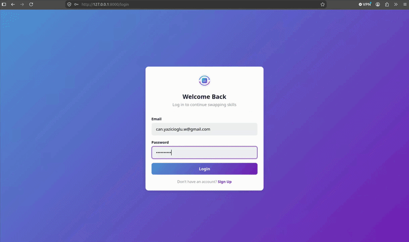

# SkillSwap

A web app that matches people who want to teach a skill with people who want to learn one, through a swipe based interface inspired by dating apps.



## The idea

Someone who plays guitar but wants to learn Python, and someone who codes but wants to play guitar, should be able to find each other in two swipes. SkillSwap builds a profile from the skills you offer and the skills you want, then surfaces mutual matches and opens a chat between the two people.

## Features

**Accounts and profiles**

- Email and password sign up and login through Supabase Auth, with client side validation on both forms
- Profile setup where a user writes a bio and builds two separate skill lists, one for what they can teach and one for what they want to learn, managed as add and remove tags
- Skills are stored in a normalised `skills` table and linked through a `user_skills` join table, so a skill is reused across users rather than duplicated

**Swiping and matching**

- One profile card at a time, with like and pass buttons and directional swipe animations
- The queue automatically excludes you and anyone you have already swiped on, so no profile is shown twice
- Mutual match detection, so liking someone who has already liked you triggers a match overlay
- An empty state for when there is nobody left to swipe on

**Matches and messaging**

- A matches page listing everyone you have matched with, with live client side search and a running match count
- One to one chat per match, with messages ordered chronologically and rendered as sent and received bubbles with timestamps

**Under the hood**

- A FastAPI REST API where every `/api` route is guarded by a dependency that validates the caller's Supabase JWT via `HTTPBearer`
- Supabase (PostgreSQL) backing auth, profiles, skills, swipes, matches and messages
- A frontend written in plain JavaScript ES modules with no framework, plus a shared `app.js` that provides the authenticated fetch wrapper, toast alerts, inline form errors, initials based avatars and a responsive hamburger navbar
- Static pages served directly by FastAPI, including a custom 404 page

## Tech stack

| Layer    | Tech                                       |
|----------|--------------------------------------------|
| Backend  | Python 3, FastAPI, Uvicorn                 |
| Database | Supabase (PostgreSQL)                      |
| Auth     | Supabase Auth (JWT)                        |
| Frontend | HTML, CSS, vanilla JavaScript (ES modules) |

## Project structure

```
main.py                 FastAPI entry point, routes and page handlers
schema.sql              database schema for the Supabase project
backend/
  database.py           all Supabase queries and matching logic
frontend/
  templates/            HTML pages
  static/               JavaScript modules, styles and assets
requirements.txt
```

## Setup

**1. Set up the database**

Create a project at [supabase.com](https://supabase.com), open the SQL editor and run the contents of `schema.sql`.

**2. Configure environment variables**

Copy `.env.example` to `.env` and fill in the values from your Supabase project settings.

```
SUPABASE_URL=
SUPABASE_PUBLISHABLE_KEY=
SUPABASE_SECRET_KEY=
```

**3. Install and run**

```bash
git clone https://github.com/can-yazicioglu/SkillSwap.git
cd SkillSwap

python -m venv venv
source venv/bin/activate

pip install -r requirements.txt
uvicorn main:app --reload
```

On Windows, activate the virtual environment with `venv\Scripts\activate` instead.

The app is then available at http://127.0.0.1:8000

## Roadmap

- [ ] Real time chat updates instead of loading the conversation on page load
- [ ] Skill based ranking of the swipe queue rather than returning the first available profile
- [ ] An environment aware API base URL so the app can be deployed
- [ ] Automated tests for the matching logic

## What I worked on

I set up and led this project. My focus was on the Login/Logout pages. I have also done the common sections of the pages such as NavBar, Background etc. It was also my responsibility to organise the structure of the website and lead the project, assign everyone their roles... 

## Team

Built as a first year group project at the University of Manchester by Ali Ahmari, Henry Li, Isaac Chung, Yusuf Hussein, Shivam Babbar and Can Yazıcıoğlu.

## License

Released under the MIT License. See [LICENSE](LICENSE) for details.
